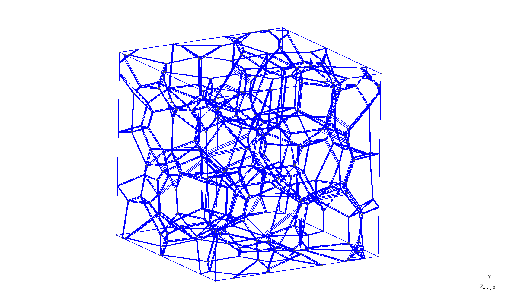
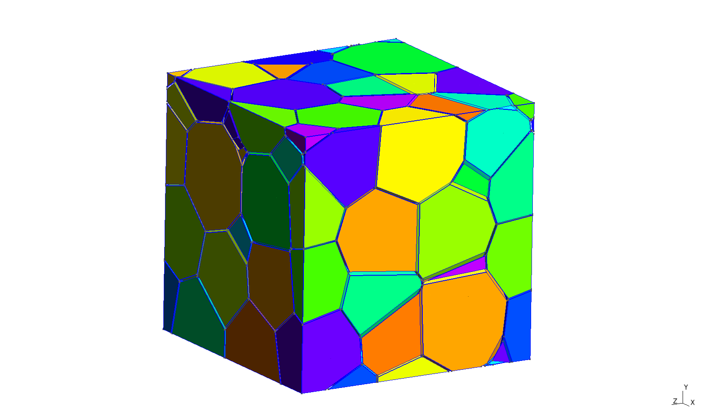
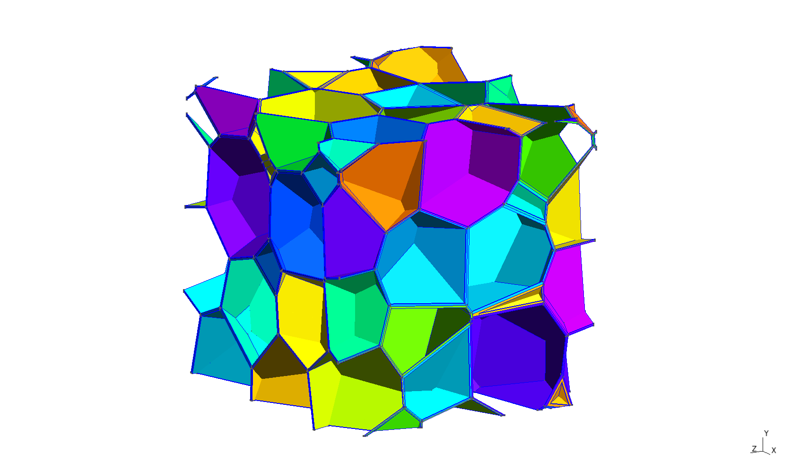

Geometrical morphology
======================

The goal is to create spatially three-dimensional CAD geometry of foam
morphology. At this moment, only closed-cell foams without struts are
supported. Creation of closed-cell foams with struts and open-cell foams is
possible through :doc:`structuredMesh`, which does not need morphology defined
in CAD format.

Closed-cell foams without struts
--------------------------------

These foams consist only of cells and thin walls. They can be characterized by
cell size distribution and porosity or by cell size distribution and wall
thickness. Strut content in these foams is zero.

Inputs
::::::

Required inputs are the ``*Tessellation.geo`` file, which is created by
tessellation (see :doc:`tessellation`), and wall thickness, which can be
provided through CLI or configurational file.

Execution
:::::::::

Foam can be created by running::

    foamgen -m

This produces foam morphology similar to this one:

Outputs
:::::::

The main output is the ``*Morphology.geo`` file, which contains the foam
morphology that can be read by ``gmsh``. The file defines periodic faces for
meshing purposes and two physical volumes. Physical volume for cells:

Physical volume for walls:

Files ``*Cells.geo`` and ``*Walls.geo`` contain exactly same morphology before
it was moved to a periodic box. File ``*CellsBox.brep`` and ``*WallsBox.brep``
contain the morphology in OpenCASCADE format (without definition of periodicity
and physical volumes).

Implementation
::::::::::::::

The walls are created by insetting (shrinking) each cell. The walls are then
defined as the difference between the original and shrunken cell.

The translation of the original foam into a periodic box is achieved using gmsh
OpenCASCADE kernel. Unfortunately, this step and subsequent checking for point
duplicity is very time consuming. This should be investigated further.

Closed-cell foams with struts
-----------------------------

Currently not supported. Hopefully will be added soon.

Open-cell foams
---------------

Currently not supported. Hopefully will be added soon.
