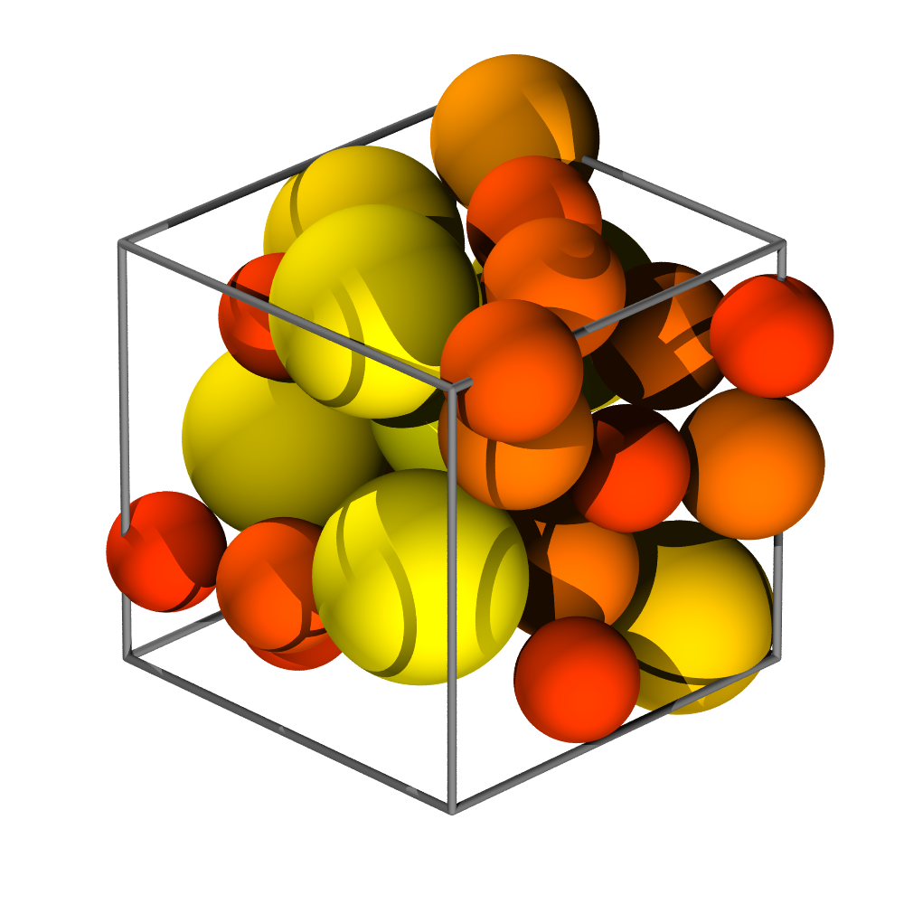
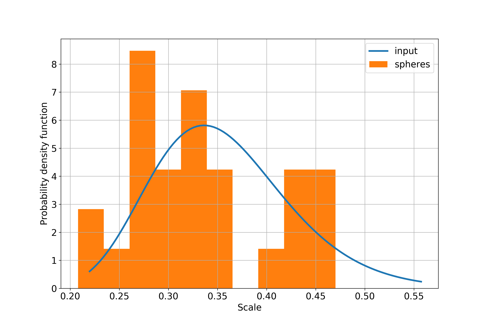

Sphere packing
==============

The goal of sphere packing is to initialize the tessellation. Packing is
performed in spatially three-dimensional periodic domain. Sphere centers are
used as cell seeds and sphere diameters are used as cell weights.

**Packing determines the number of cells and their size distribution in the
generated foam.**

Inputs
------

Number of cells and shape and scale parameters of log-normal size distribution
should be provided either through CLI or configurational file (otherwise
default values are taken).

Execution
---------

Default packing can be achieved by running::

    foamgen -p

This produces packing similar to this one (you need to add ``--pack.render``
flag if you want to create the image):

Outputs
-------

The main output is the ``*Packing.csv`` file, which contains center position
(``x``, ``y``, and ``z``) and diameter (``d``) of each sphere.

Size distribution
-----------------

Note that sphere size distribution does not exactly copy prescribed continual
size distribution (especially for low number of spheres - image below is for 27
cells).

Log-normal sphere size distribution is influenced by shape (``--pack.shape``)
and scale (``--pack.scale``). It is defined as

.. math::

    p = \frac{1}{\delta \sigma \sqrt{2 \pi}} \exp \left( - \frac{\left(
    \log{(\delta)} - \mu \right)^2}{2 \sigma^2} \right)

where :math:`\delta` is sphere size, :math:`\sigma` is standard deviation, and
:math:`\mu` is mean. Shape is identical to standard deviation. Scale,
:math:`\phi`, is defined as

.. math::

    \phi = \exp(\mu)

Shape equal to zero corresponds to uniform size distribution. Shape larger than
0.5 corresponds to wide size distribution.

Algorithms
----------

It is possible to choose between several sphere packing algorithms using
``--pack.alg`` flag. ``simple`` is a naive packing algorithm that is
implemented directly. ``ls``, ``fba``, ``lsgd``, ``lsebc``, ``ojt``, ``kjt``
are more robust algorithms from `packing-generation
<https://github.com/VasiliBaranov/packing-generation>`_ library. ``fba``
provides good compromise between speed and packing density.
