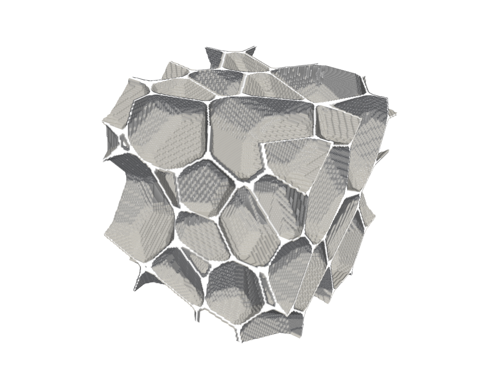

Structured meshing
==================

The goal is to create a structured equidistant hexahedral cartesian mesh for
calculations of foam properties.

Inputs
------

Required inputs are the ``*TessellationBox.stl`` file, which is created by
tessellation generation process (see :doc:`tessellation`), and target foam
porosity and strut content, which can be provided through CLI or
configurational file.

Execution
---------

Default mesh can be created by running::

    foamgen -s

This produces ``*SMesh.vtk`` file similar to this one:

Outputs
-------

By default the mesh is saved in VTK format (``*SMesh.vtk``). It can be viewed
with Paraview.

Implementation
--------------

:doc:`morphology` is not used for structured meshing at all. Foam morphology is
created on the equidistant grid. The walls are created using ``binvox``
program, which marks all voxels intersected by tessellated surface as solid
voxels. Thus, wall thickness is always 1-2 voxels. Desired foam porosity is
achieved by scaling the computational domain - more voxels in each direction
lead to higher ratio of cell to wall voxels, and thus to higher porosity.
Struts are created by ``foamreconstr`` program, which adds triagonal prism
along each edge and marks the voxels within. Root finding method is employed to
find the correct domain and strut size.

Note that high porosity and high strut content lead to large domain sizes,
which is very time and memory consuming.
