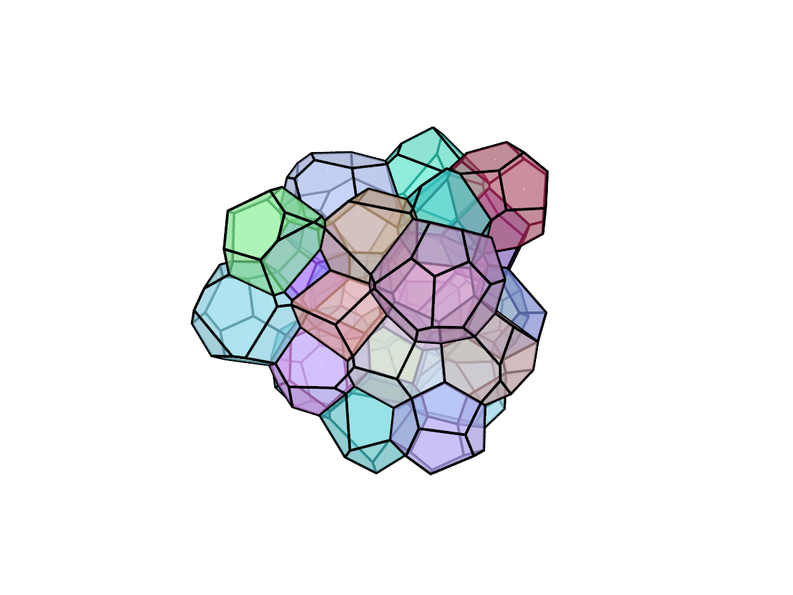

Tessellation
============

Theory
------

The weighted Voronoi tessellation (also known as Laguerre tessellation) is used
to divide the periodic domain into cells. The packed spheres are used as seeds
and weights for the tessellation algorithm. Mathematically, Laguerre
tessellation can be written as

.. math::

    C_k = \left\{x \in \mathbb{R}^d: ||x - S_k||^2 - w_k \le
    ||x - S_j||^2 - w_j \hspace{5pt}\forall j \neq k \right\}

where :math:`C` is the cell, :math:`S` is the seed and :math:`w` is the weight.

Implementation
--------------

Third-party program `Neper <http://neper.sourceforge.net/>`_ is used to perform
the tessellations.

Execution
---------

Tessellation can be achieved by running::

    foamgen -t

This produces packing similar to this one (you need to add ``--tess.render``
flag if you want to create the image):

Note that you need to create sphere packing first (see :doc:`packing`).
