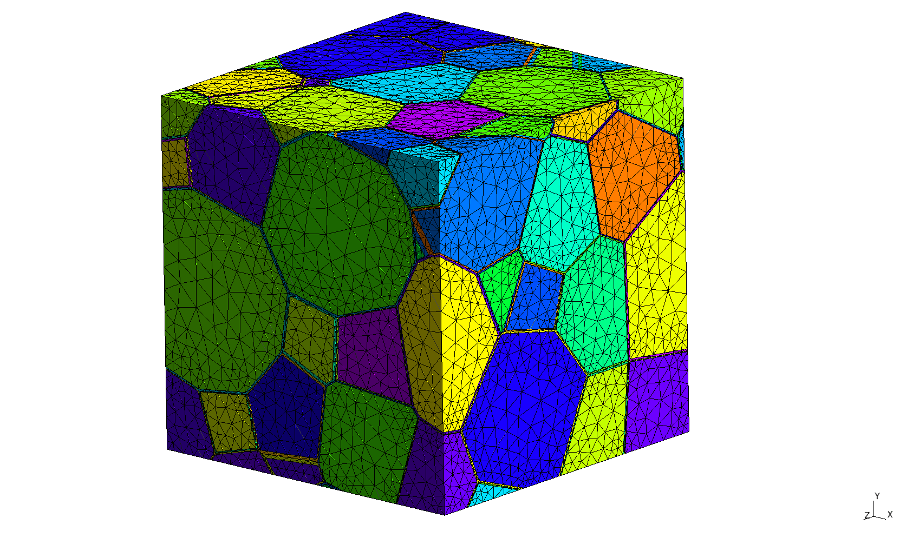

Unstructured meshing
====================

The goal is to create an unstructured tetrahedral mesh for calculations of foam
properties.

Inputs
------

Required inputs are the ``*Morphology.geo`` file, which is created by
morphology generation process (see :doc:`morphology`), and mesh sizing
information, which can be provided through CLI or configurational file.

Execution
---------

Default mesh can be created by running::

    foamgen -u

This produces mesh similar to this one:

Outputs
-------

By default the mesh is saved gmsh format (``*UMehs.msh``) and converted into
dolfin/fenics format (``*UMesh.xml`` and ``*UMesh_physical_region.xml``).

Implementation
--------------

``gmsh`` is used for meshing and ``dolfin-convert`` is used for mesh
conversion.

Mesh sizing
-----------

Mesh sizing is determined from following parameters:

* ``--umesh.psize``: size near geometry points (vertices)
* ``--umesh.esize``: size near geometry edges
* ``--umesh.csize``: size in the middle of geometry cells
